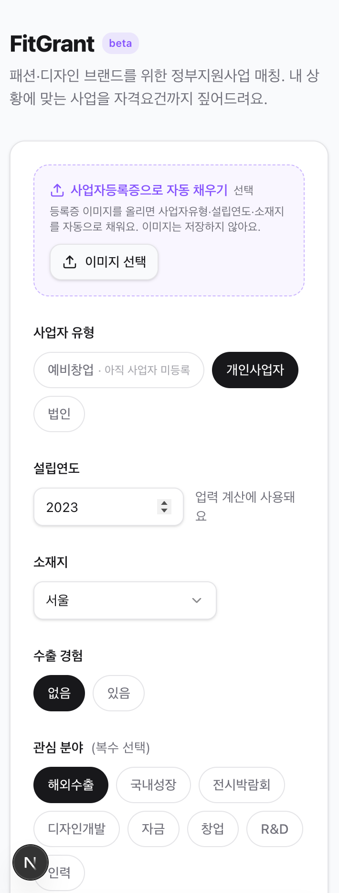
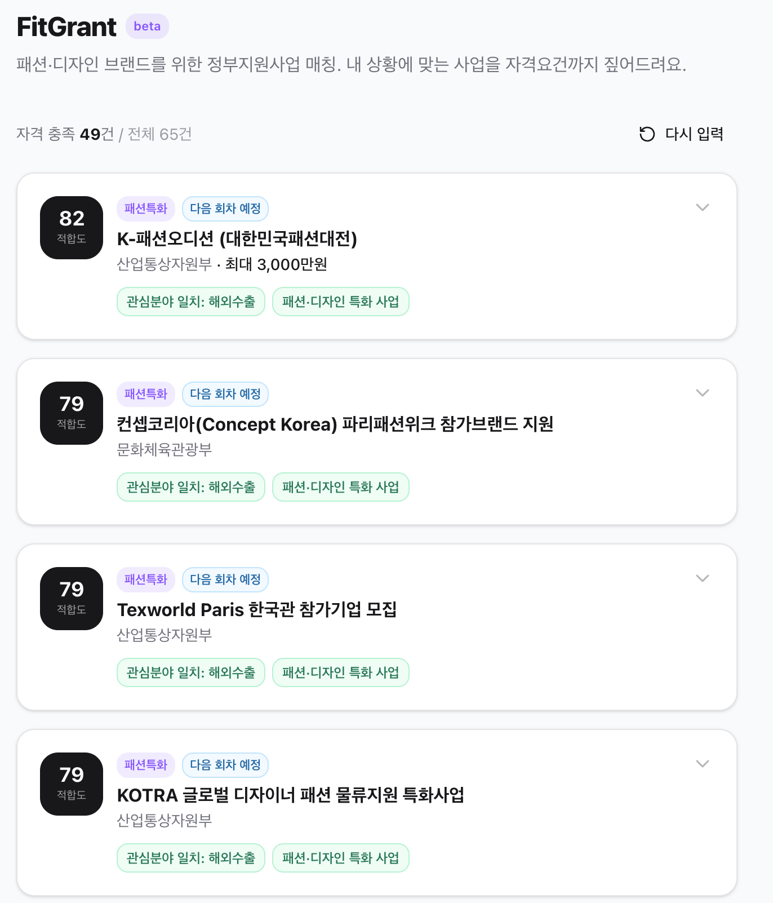
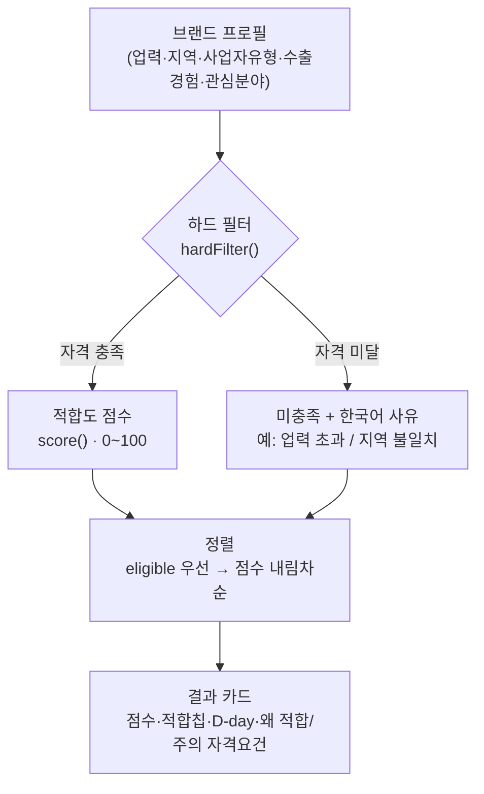

# FitGrant

> 패션·디자인 브랜드를 위한 **정부지원사업 매칭 PWA** — 내 브랜드 상황에 맞는 사업을 *자격요건까지 짚어서* 골라줍니다.

[](https://nextjs.org)
[](https://www.typescriptlang.org)
[](https://tailwindcss.com)
[]()

---

## 한 줄 요약

브랜드 상황(업력·지역·수출경험·관심분야)을 입력하면, **신청 자격을 충족하는** 정부지원사업을 적합도 순으로 추천하고 — 단순 나열이 아니라 **"왜 적합한지"와 "놓치기 쉬운 자격요건"까지** 함께 짚어줍니다.

## 스크린샷

| 온보딩 | 결과 · 상세 |
|---|---|
|  |  |

> 데모 프로필 *법인 · 업력 5년 · 서울 · 수출경험 있음 · 관심 해외수출/전시* → 자격충족 **53/65**, 해외진출 트랙(컨셉코리아·Texworld Paris·서울패션위크)이 상위 정렬. 카드를 펼치면 **"왜 적합한가요"(녹색)** 와 **"신청 전 확인하세요"(자격요건)** 를 함께 보여줍니다.

## 왜 만들었나 (문제 정의)

정부지원사업 정보는 **널려 있지만 분산돼 있고**, 정작 패션·디자인 브랜드에게 의미 있는 사업을 골라내고 *자격요건을 미리 확인*하는 건 어렵습니다. 공고를 다 읽고 나서야 "우리는 업력 초과라 신청 불가"임을 깨닫는 일이 흔합니다.

기존 종합 포털은 **범용**이라 패션 도메인 맥락(수출바우처·서울패션위크·컨셉코리아 같은 사업, "예비창업/디자이너/기업브랜드" 구분)이 약합니다.

> **차별점 = 도메인 전문성.** 기획자가 정부사업지원 + 해외수출 실무를 직접 담당했고, 그 지식을 **데이터 스키마와 매칭 로직**에 녹였습니다. 화면이 아니라 *데이터·로직 자체가 해자(moat)*입니다.

## 핵심 기능 (P0 MVP)

1. **온보딩** — 사업자유형·설립연도·소재지·수출경험·관심분야 입력
2. **매칭 엔진** — 하드 필터(자격 미충족 사업은 *한국어 사유와 함께* 제외) + 적합도 점수(0~100)
3. **결과·상세 카드** — 점수·적합칩·D-day·펼침 상세·공고 원문 링크
4. **적합 사유 / 주의 자격요건 생성** — "왜 적합한가요"(녹색) + "신청 전 확인하세요"(amber)

## 매칭 파이프라인



자격 미달은 점수로 깎는 게 아니라 **분리하고 '왜 안 되는지'를 붙입니다.** 자세한 규칙·가중치는 [매칭 로직 설계](docs/matching-logic.md).

## 설계 의사결정 (이 프로젝트의 알맹이)

> 이 결정들이 **어떤 문제·시장 맥락**에서 나왔고 무엇이 베끼기 어려운지는 **[케이스 스터디](docs/CASE-STUDY.md)** 참고.


| 결정 | 선택 | 이유 |
|---|---|---|
| **자격요건 설명 생성** | 룰 기반을 **기본**, Claude(Haiku)는 *선택적 향상 레이어* | 정부지원사업은 **자격요건 환각이 치명적**. 규칙으로 결정적·환각0 문장을 보장하고, Claude는 "더 자연스러운 표현"만 담당. **주의(자격요건) 블록은 항상 룰 기반 결정값**으로 통과시켜 환각 차단. |
| **데이터 저장** | 현재 **seed JSON 번들** (Supabase 스키마는 작성 완료, 연결은 다음 단계) | DB 없이도 앱이 100% 동작 → 데모·배포 마찰 최소화. 키·계정 없이 바로 돌아감. |
| **매칭 엔진** | 부수효과 없는 **순수 함수** (`hardFilter` + `score`) | 콘솔 데모·단위 테스트가 쉽고, 가중치 튜닝을 데이터처럼 다룰 수 있음. |
| **UI** | shadcn/ui **컴포넌트 카피인** (CLI 대신) | 프로젝트의 `.ts` import 컨벤션과 Tailwind v4 토큰을 CLI가 덮어쓰지 않게. |
| **데이터 신뢰도** | `confirmed` / `needs_review` 플래그 + `fashion_specific` 태그 | 2025 공고 기준 데이터는 "확인필요"로 정직하게 표기. 도메인 검증을 거쳐 `confirmed`로 승격. |

## 기술 스택

| 영역 | 사용 |
|---|---|
| Frontend/Backend | Next.js 16 (App Router), React 19 |
| 스타일 | Tailwind CSS v4 + shadcn/ui |
| AI | Claude API (`claude-haiku-4-5`) — 적합 사유 재작성, 캐싱 |
| DB (예정) | Supabase (스키마·RLS 작성 완료) |
| 배포 | Vercel |
| 런타임 | Node 26 네이티브 TypeScript 실행 |

## 빠른 시작

```bash
npm install
npm run dev          # → http://localhost:3100
npm run match:demo   # 매칭 엔진 콘솔 데모
```

Supabase·API 키 **없이도** seed 데이터로 완전히 동작합니다.
Claude 설명 레이어를 켜려면 `.env.local.example`를 `.env.local`로 복사하고 `ANTHROPIC_API_KEY`를 넣으세요(선택).

## 프로젝트 구조

```
src/
├── app/                  # page.tsx(폼↔결과), api/explain(Claude 레이어, 서버 전용)
├── components/           # OnboardingForm, ResultCard, ui/(shadcn 프리미티브)
└── lib/                  # match.ts(매칭 순수함수), explain.ts(룰 기반), types.ts, programs.ts
data/programs.seed.json   # 패션·디자인 지원사업 65건 (수작업 큐레이션)
supabase/                 # schema.sql · seed.sql · README (적용 가이드)
docs/                     # PRD · 매칭 로직 설계 · 검토 체크리스트 · 진행 현황
```

## 데이터

패션·디자인 브랜드 대상 지원사업 **65건**을 수작업 큐레이션 (해외수출·국내성장·전시·디자인·자금·창업·R&D·인력).
신뢰도: `confirmed` 26 / `needs_review` 39 — 후자는 [검토 체크리스트](docs/needs-review-checklist.md)로 2026 공고 재확인 진행 중.

> ⚠️ 저작권: 본 서비스는 공고의 **요약 + 원문 링크**만 제공하며, 최종 자격·일정은 공고 원문 확인이 필요합니다.

## 로드맵

- [x] Week 1 — 데이터 모델 · 큐레이션 65건
- [x] Week 2 — 매칭 엔진 · 온보딩/결과 화면 · 적합 사유 생성
- [x] Week 3 — 품질 보강 (shadcn/ui · Claude 설명 레이어)
- [ ] **배포 (Vercel) ← 현재 단계**
- [ ] Supabase 실연결 (관심사업 저장)
- [ ] 마감 알림 (PWA 푸시/이메일)
- [ ] `needs_review` 39건 2026 원문 보강

## 진행 현황

전체 맥락은 [docs/PROGRESS.md](docs/PROGRESS.md) 참고.

---

*이직 포트폴리오 겸 창업 사이드 프로젝트 · 2026*
