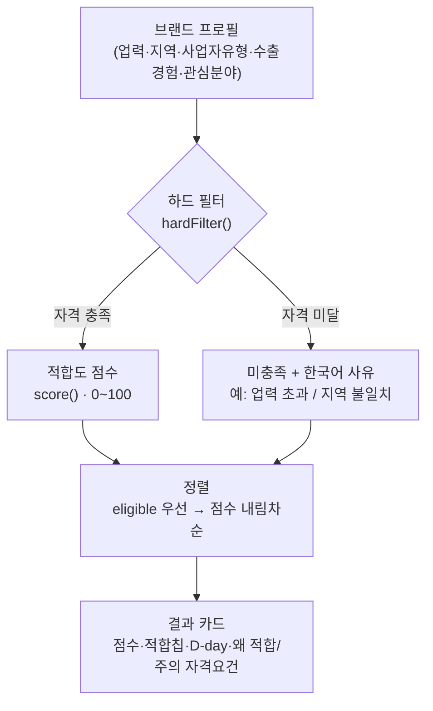

# FitGrant 매칭 로직 (v0.1)

순수 함수 모듈: [`src/lib/match.ts`](../src/lib/match.ts) · 타입: [`src/lib/types.ts`](../src/lib/types.ts) · 데모: `node scripts/demo-match.ts`

## 파이프라인

> 핵심 의도: 자격 미달은 점수로 깎는 게 아니라 **분리하고 '왜 안 되는지'를 붙인다.**

## 2단계 구조

### 1) 하드 필터 — `hardFilter()`
자격 미달이면 "조건 미충족"으로 분리하고, **사람이 읽는 사유**를 함께 반환한다.

| 규칙 | 조건 | 비고 |
|---|---|---|
| 예비창업전용 | `max_years === 0` 인데 이미 창업함 | 미창업자(예비창업)만 |
| 업력상한 | 업력 > `max_years` | |
| 업력하한 | 업력 < `min_years` | 예: 융자 신성장기반 7년↑ |
| 지역 | `region`에 "전국" 없고 소재지 불일치 | |
| 사업자유형 | `biz_type` 불일치 | 예비창업은 개인/법인 허용 사업과 호환 처리 |
| 수출실적 | `export_required` 인데 수출경험 없음 | 글로벌강소기업 등 |
| 업종 | `industries` 제한 사업인데 업종 불일치 (업태를 밝힌 경우만) | 소공인 제조·디자인전문회사 등. 미입력이면 미적용 |

### 2) 적합도 점수 — `score()` (0~100, 기본 50)
| 항목 | 가점 |
|---|---|
| 관심분야 일치 (category ∩ interests) | 건당 +12, 최대 +36 |
| 패션·디자인 특화 사업 | +14 |
| 해외수출 사업 ↔ 수출경험 시너지 | +8 |
| 마감 임박 D-30 이내 / D-60 이내 | +8 / +4 |
| 마감 지남: 재공고 사업 / 일회성 | +2 / −8 |
| 상시·정기 모집(마감일 없음) | +3 |
| confirmed 신뢰도 | +7 |
| 지원규모 1억↑ / 1천만↑ | +6 / +3 |

정렬: eligible 우선 → 점수 내림차순 (미충족은 사유 적은 순).

## 알려진 한계 / 향후 보강
- **데이터 최신성**: 시드가 대부분 2025 공고라 데모에서 "마감지남"이 다수. 실 운영 시 2026 일정으로 갱신 필요 (`needs_review` 39건).
- **가중치 1차 튜닝(2026-06)**: 적합도를 *fit 중심*으로 조정 — 마감 임박↓(15→8, 8→4, 시급성은 D-day 배지·임박 배너가 담당), 패션특화↑(10→14, 차별점), 수출 시너지↑(6→8, 메인 트랙), 신뢰도↑(5→7). 추가 실데이터 피드백으로 재조정 여지.
- **track 미반영**: 디자이너/기업브랜드 트랙을 프로필에서 직접 추론하지 않음 — 온보딩에 트랙 질문 추가 검토.
- **매출 상한 미사용**: `max_revenue` 필터는 데이터에 값이 거의 없어 보류.
